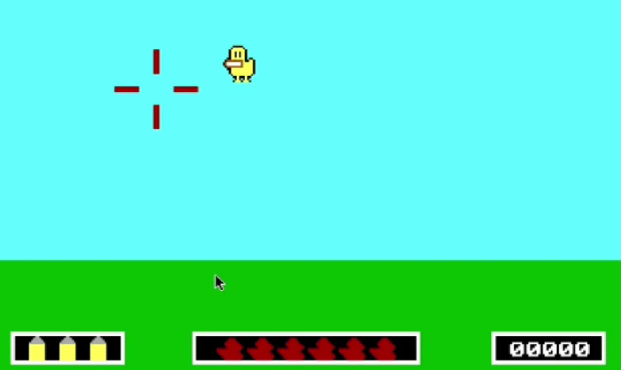
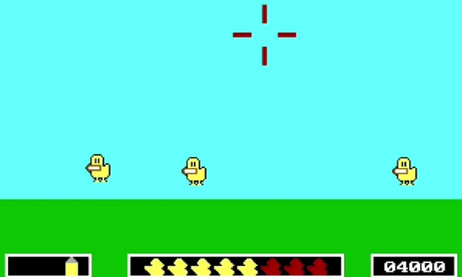

# 🦆 Duck Shooter Game — Assembly Language Project

A retro-style 2D Duck Shooter Game developed in **x86 Assembly Language** using **MASM 6.15**, running in **DOSBox**. This game demonstrates low-level graphics control, keyboard input handling, scoring logic, and level design — all programmed with precise memory and CPU control.


  

---

## 📌 Project Overview

The Duck Shooter game simulates a simple shooting arcade game where the player aims and shoots ducks that fly across the screen. The game includes interactive menus, score tracking, hit/miss counters, and customizable settings like background color and key bindings.

This project was developed as part of a low-level systems or computer architecture course, showcasing the capabilities of Assembly Language in building interactive applications.

---

## 🎮 Game Features

- ✅ **Interactive UI**: Menus for starting the game, choosing levels, and customizing settings
- 🔫 **Crosshair-Based Shooting**: Move the crosshair using arrow keys and shoot with the `Enter` key
- 💥 **Duck Animation**: Ducks appear and fly across the screen; the player must shoot them before they escape
- 📊 **Scoring System**: Tracks hits, misses, and total score with real-time display
- 🏆 **Leaderboard System**: High score tracking and player rankings
- 📋 **Result Screen**: Detailed performance summary after each level
- 🧠 **3 Difficulty Levels**: Progressive difficulty with varying duck speeds and patterns
- 🎨 **Color Customization**: Change the background color for different visual themes
- ⚙️ **Key Bindings Info**: View control mappings in the settings menu
- 💾 **Name Input**: Player can input their name before starting
- 💾 **File Operations**: Game data persistence using `gamedata.txt`

---

## 🛠 Requirements

| Tool | Version / Info |
|------|----------------|
| [MASM 6.15](https://winworldpc.com/product/masm/615) | Microsoft Macro Assembler |
| [DOSBox](https://www.dosbox.com/) | x86 emulator for running MASM |
| A `.ASM` file editor | e.g., DOSBox `edit`, Notepad++, or any IDE with ASM support |

---

## 🚀 How to Run the Game

1. **Install and set up MASM and DOSBox**:
   - Extract MASM615 into `C:\masm615`
   - Place `kkk.asm` in a folder like `C:\masm615\duckshooter`

2. **Launch DOSBox** and mount the directory:
   ```dos
   mount c c:\masm615
   c:
   cd duckshooter
   ```

3. **Compile and run**:
   ```dos
   masm kkk.asm;
   link kkk.obj;
   kkk.exe
   ```

---

## 🎮 Game Controls

| Action | Key |
|--------|-----|
| Move Up | ↑ Arrow |
| Move Down | ↓ Arrow |
| Move Left | ← Arrow |
| Move Right | → Arrow |
| Shoot | Enter |
| Pause | Esc |
| Resume | Y |
| Restart | R |
| Exit Game | Z |

---

## 🎯 Gameplay Mechanics

### Game Interface
- **Cyan Sky Background**: Classic retro gaming aesthetic
- **Green Ground**: Clear visual separation between sky and ground
- **Red Crosshair**: Precise targeting system with smooth movement
- **Yellow Ducks**: Animated duck sprites flying across the screen

### Scoring & Progress Tracking
- **Ammunition Counter**: Left panel shows remaining bullets (yellow bullets)
- **Hit Counter**: Middle panel displays successful hits (red duck silhouettes)
- **Score Display**: Right panel shows current score (starts at 00000)

### Level Progression
- **Level 1**: Single duck, moderate speed
- **Level 2**: Multiple ducks (up to 3), increased challenge
- **Level 3**: Advanced patterns and faster duck movement

### Game States
- **Active Gameplay**: Real-time duck shooting with crosshair control
- **Result Screen**: Performance summary after each level
- **Leaderboard**: High score comparison and ranking system

---

## 🏗️ Technical Implementation

### Graphics System
- **VGA Mode Programming**: Direct video memory manipulation
- **Sprite Animation**: Duck movement and crosshair positioning
- **Color Management**: Custom palette for game elements


### Game Logic
- **Collision Detection**: Precise hit detection between crosshair and ducks
- **Timer System**: Level duration and duck spawn timing
- **State Management**: Menu navigation and game flow control
- **Score Calculation**: Real-time scoring with bonus systems

### File I/O Operations
- **Game Data Persistence**: Using `gamedata.txt` for high scores
- **Player Profiles**: Name storage and retrieval
- **Settings Storage**: Custom configurations and preferences

### Assembly Programming Techniques
- **DOS Interrupts**: INT 21h for file operations and I/O
- **Memory Management**: Efficient sprite and data storage
- **Keyboard Handling**: Real-time input processing
- **Game Loop**: Continuous gameplay cycle implementation

---

## 📚 Learning Objectives

This project helped reinforce:

- **Low-level graphics and memory manipulation**
- **Real-time input handling in Assembly**
- **Structuring large ASM projects**
- **Game loop implementation in assembly**
- **Using DOS interrupts for I/O and graphics**
- **File operations using INT 21h (via `gamedata.txt`)**
- **Sprite animation and collision detection**
- **State machine implementation for game flow**

---

## 🏆 Game Features Breakdown

### Level System
```
Level 1: Tutorial Level
- 1 duck at moderate speed
- Basic crosshair movement


Level 2: Intermediate Challenge  
- Multiple ducks (2 simultaneously)
- Faster duck movement


Level 3: Expert Mode
- Multiple ducks (3 simultaneously)
- Advanced duck patterns
- Maximum difficulty
- More Faster duck movement

```

### Scoring Mechanism
- **Successful Hit**: Points based on accuracy and timing
- **Hit Failesd**: Result in the deduction of score

---

## 📁 Project Structure

```
DuckShooter/
├── project.asm              # Main game source code
├── gamedata.txt         # High scores and game data
├── project.obj              # Compiled object file
├── project.exe              # Game executable
└── README.md            # This documentation
```

---

## 🎖️ Development Achievements

- **Complete Game Loop**: Implemented full game cycle from menu to gameplay
- **Multi-Level Design**: Progressive difficulty scaling
- **Persistent Storage**: File-based high score system
- **Smooth Animation**: Flicker-free sprite movement
- **Responsive Controls**: Real-time keyboard input handling
- **Visual Polish**: Retro aesthetic with clear UI elements

---

## 🔧 Technical Specifications

- **Assembly Language**: x86 MASM 6.15 syntax
- **Platform**: MS-DOS via DOSBox emulation
- **Graphics Mode**: Text/Character mode with custom sprites
- **Memory Usage**: Optimized for 640KB DOS memory limit
- **File Format**: Plain text data storage
- **Input Method**: Direct keyboard port access

---

## 🎯 Gameplay Screenshots


*Single duck gameplay with crosshair targeting, ammunition counter, hit tracker, and score display*


*Multi-duck level with three simultaneous targets, showcasing increased difficulty and challenge progression*

---

## 🏅 Educational Value

This project serves as an excellent example of:
- **System-level programming** concepts
- **Hardware interaction** through assembly language
- **Game development fundamentals** without high-level abstractions
- **Memory management** in constrained environments
- **Real-time programming** techniques
- **File I/O operations** at the system level

---

## 🎮 Future Enhancements

Potential improvements could include:
- Sound effects using PC Speaker
- Additional duck types and behaviors
- Power-ups and special ammunition
- Multiplayer score competition
- Enhanced graphics with more detailed sprites

---

**Enjoy classic duck hunting in Assembly! 🦆🎯**